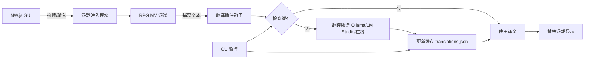

# RPG MV 翻译程序实施计划

## 项目概述
本项目旨在创建一个基于NW.js的桌面程序，用于实时钩住RPG Maker MV游戏的文本，进行翻译（优先Ollama本地模型），并使用JSON缓存避免重复翻译。翻译结果一一对应存储，如{"オーブ": "宝珠"}。GUI支持拖拽游戏窗口或输入路径自动注入插件。

目标语言：日文到简体中文（可配置）。后端优先：Ollama > LM Studio > 在线API。

现有基础：rpg-mv-translator-plugin.js（钩子、翻译、缓存）、test-translation.js（测试）。

## 系统架构
### 关键组件
1. **RPG MV 游戏钩子**：JS插件覆盖Window_Message.add，捕获文本。
2. **翻译服务**：异步调用Ollama API，提示模板确保精确翻译。
3. **缓存管理**：JSON文件（./cache/translations.json），支持加载/保存/查询。
4. **NW.js GUI**：主界面加载游戏，侧面板显示翻译日志、缓存管理、配置、注入面板（拖拽/输入游戏路径）。
5. **注入机制**：优先文件复制（插件到游戏js/plugins目录），备选进程注入。

### 数据流图


### 技术栈
- NW.js：GUI框架。
- JavaScript/Node.js：核心逻辑。
- JSON：缓存格式。
- fs/path：文件操作。
- fetch：API调用。

## 实施步骤（Todo列表）
1. [x] 分析现有代码：审查rpg-mv-translator-plugin.js、test-translation.js等，确认钩子、翻译、缓存功能完整性。
2. [x] 设计系统架构：定义组件交互，包括注入机制。
3. [-] 实现NW.js GUI：创建界面（HTML/CSS/JS），包括实时翻译显示、缓存管理、配置面板、游戏注入面板（拖拽事件、输入框）。
4. [ ] 集成插件到NW.js：实现自动注入（fs.copyFileSync复制插件到游戏目录；使用child_process启动游戏）。
5. [ ] 优化缓存：确保JSON键值一一对应，添加批量加载/导出（按钮触发JSON导入/导出）。
6. [ ] 测试功能：运行NW.js，验证翻译准确性（示例文本）、缓存命中率、性能（<500ms/翻译）、注入成功（日志确认）。
7. [ ] 更新文档：完善README.md，包括安装、配置、注入步骤、示例JSON。

## 时间估算与依赖
- 总时长：3-5天（假设全职）。
- 依赖：NW.js环境、Ollama安装、RPG MV游戏项目。
- 风险：
  - 注入失败：备选手动复制插件。
  - API延迟：添加超时/重试（3次）。
  - 跨平台：测试Windows（当前OS），扩展macOS/Linux。

## 配置示例
package.json (NW.js)：
```json
{
  "main": "index.html",
  "window": {
    "title": "RPG MV 翻译器",
    "width": 1280,
    "height": 800
  }
}
```

translations.json 示例：
```json
{
  "オーブ": "宝珠",
  "モード": "模式",
  "スペル": "咒语"
}
```

实施前，确保Ollama运行：`ollama run llama2`。

此计划可迭代调整。完成后切换到Code模式实现。